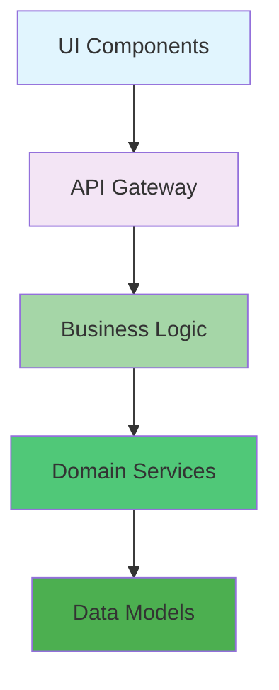

# Diagram Command

Generate comprehensive visual documentation and architecture diagrams using multiple formats and standards.

## **Command Options**

### **Target Specification**
- `target` - System, component, or process to diagram
- `--type=[flow|sequence|component|deployment|architecture]` - Diagram type (default: architecture)
- `--format=[plantuml|mermaid|drawio|svg]` - Output format (default: plantuml)
- `--style=[modern|classic|minimal]` - Visual style (default: modern)

### **Diagram Configuration**
- `--detail=[low|medium|high]` - Detail level (default: medium)
- `--interactive=[yes|no]` - Enable interactive editing (default: no)
- `--layers=[list]` - Architecture layers to include (default: all)
- `--components=[list]` - Specific components to highlight (default: all)

### **Output Configuration**
- `--export=[png|svg|pdf]` - Export format (default: svg)
- `--theme=[light|dark|auto]` - Color theme (default: auto)
- `--size=[small|medium|large]` - Diagram size (default: medium)
- `--animate=[yes|no]` - Include animations (default: no)

## **Diagram Types**

### **🏗️ Architecture Diagrams**
- **Component View**: System components and relationships
- **Deployment View**: Infrastructure and environment layout
- **Data Flow View**: Information flow and transformations
- **Security View**: Security controls and boundaries

### **🔄 Sequence Diagrams**
- **Use Case Flows**: User interactions and system responses
- **API Interactions**: Service communication patterns
- **Error Handling**: Exception flows and recovery processes
- **Authentication Flows**: Login and authorization sequences

### **📦 Component Diagrams**
- **Class Structure**: Object-oriented design relationships
- **Module Dependencies**: Internal and external dependencies
- **Interface Contracts**: API boundaries and specifications
- **Package Organization**: Code structure and namespaces

### **🚀 Deployment Diagrams**
- **Infrastructure Layout**: Servers, networks, and storage
- **Container Orchestration**: Docker/Kubernetes deployment
- **CI/CD Pipeline**: Build, test, and deployment flow
- **Environment Configuration**: Development, staging, production

## **Architecture Layers**

### **🎨 Presentation Layer**
- **User Interfaces**: Web, mobile, API endpoints
- **UI Components**: React, Vue, Angular components
- **Experience Design**: UX flows and interaction patterns

### **🏢 Application Layer**
- **Business Logic**: Domain services and workflows
- **API Gateway**: Request routing and validation
- **Authentication**: User management and security
- **Integration**: External service connections

### **📊 Domain Layer**
- **Business Rules**: Validation and transformation logic
- **Data Models**: Entity relationships and constraints
- **Repositories**: Data access patterns
- **Domain Services**: Core business capabilities

### **💾 Data Layer**
- **Databases**: SQL, NoSQL, in-memory stores
- **Caching**: Redis, Memcached, application cache
- **Message Queues**: RabbitMQ, Kafka, SQS
- **File Storage**: S3, Azure Blob, local filesystem

## **Usage Examples**

```bash
# Complete architecture diagram
/diagram --type=architecture --format=plantuml --layers=all --detail=high

# Component interaction diagram
/diagram user-authentication --type=sequence --format=mermaid --style=modern

# Deployment infrastructure diagram
/diagram --type=deployment --format=drawio --export=png --theme=dark

# Interactive diagram editing
/diagram api-gateway --interactive=yes --detail=medium --export=svg

# System flow diagram
/diagram --type=flow --layers=presentation,application,domain --format=plantuml --size=large
```

## **Output Formats**

### **PlantUML**
```plantuml
@startuml
!theme modern
skinparam monochrome false

package "Presentation Layer" {
  [UI Components]
  [API Gateway]
}

package "Application Layer" {
  [Business Logic]
  [Domain Services]
}

package "Domain Layer" {
  [Data Models]
  [Repositories]
}

[UI Components] --> [API Gateway]
[API Gateway] --> [Business Logic]
[Business Logic] --> [Domain Services]
[Domain Services] --> [Data Models]
@enduml
```

### **Mermaid**


This command enables creation of professional architecture diagrams that effectively communicate system design and component relationships across multiple formats and styles.